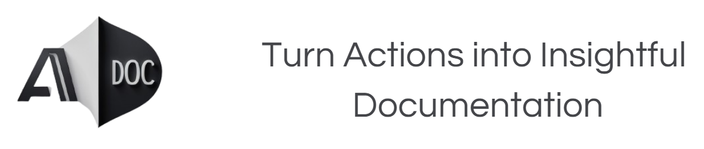

# Scrib 🍌 — The Banana-Powered Process Documentation Tool



Scrib is a high-speed, AI-powered documentation generator that translates screen recordings and video workflows into elegant, step-by-step technical "How-To" guides. Armed with robust UI-change detection and an LLM-assisted analysis pipeline, Scrib peels away the tedious work of writing guides manually.

---

## 🌟 Key Features

- **🍌 Smart Step Detection**: Analyzes screen recordings using color histograms and pixel MSE to pinpoint exact UI state transitions and click steps automatically.
- **⚡ AI-Powered Action Summaries**: Interrogates each transition frame using advanced Vision APIs (e.g. Groq Llama-4 Scout Vision, Ollama, etc.) to describe user actions in natural, bold-highlighted technical English.
- **📁 Drag & Drop Upload + Live Recording**: Supports dragging and dropping existing MP4/WebM videos or launching the in-browser Screen Recorder directly.
- **📝 Interactive Guide Tab**: Rendered with customized, responsive Markdown that embeds the exact matching screenshots inline.
- **📸 Detected Steps (Visual Timeline)**: Review extracted screenshot snapshots individually.
- **🐳 Docker Native**: Ready-to-go environment including FFmpeg static compilation for immediate workflow execution.

---

## 🚀 Quick Start (Docker)

The fastest way to spin up Scrib is using Docker Compose.

### Prerequisites

- [Docker & Docker Compose](https://docs.docker.com/engine/install/)
- An API key for your Vision LLM (e.g., Groq API key or Ollama endpoint)

### 1. Launch Scrib

Set up your `.env` variables or let the UI handle it. Start the application:

```bash
docker compose up --build
```

Access the unified React + FastAPI application in your browser:
👉 **[http://localhost:8501](http://localhost:8501)**

---

## 🛠️ Local Development Setup

If you prefer to run the components independently on your host machine:

### Backend (FastAPI)

1. **Virtual Environment**:
   ```bash
   python -m venv .venv
   source .venv/bin/activate  # On Windows: .venv\Scripts\activate
   ```

2. **Install Python Deps**:
   ```bash
   pip install -r requirements.txt
   ```

3. **Required Utilities**:
   Ensure `ffmpeg` is installed and available in your system path (e.g. `brew install ffmpeg` on macOS).

4. **Run FastAPI**:
   ```bash
   python server.py
   ```
   The backend will start on **`http://localhost:8502`**.

### Frontend (React + Vite)

1. **Navigate & Install**:
   ```bash
   cd frontend
   npm install
   ```

2. **Run Vite Dev Server**:
   ```bash
   npm run dev
   ```
   The development server will launch on **`http://localhost:8501`** and automatically proxy requests `/api/*` and `/output/*` to the FastAPI backend.

---

## ⚙️ Configuration

Scrib uses a floating settings panel right in the UI sidebar to adjust detection sensitivity:

- **Frame Similarity Threshold (0.5 - 1.0)**: Controls how different two frames must be to trigger a new step. Lower numbers ignore minor UI changes (resulting in fewer steps); higher numbers capture subtle actions.
- **Min Interval (seconds)**: Minimum elapsed video time required between steps to ignore rapid, duplicate actions.
- **LLM Settings**: Switch between local Ollama instances or fast cloud hosts (like Groq) with customized vision endpoints.

---

## 📝 License

This project is licensed under the MIT License - see the [LICENSE](LICENSE) file for details.
